# GGsBot.rs 

## TODOs
- [ ] Creare delle UI per la configurazione dei sottocomandi
> Esempio:
> /ext setup nasa:apod
>
> Qui compare una UI apposita per configurare nasa:apod 
>
> (NOTA: A questo punto non e' piu' possibile fare /ext setup nasa)

- [x] Rendere il comando /nasa apod accessibile anche nelle chat private e (in quel caso) rimuovere ephemeral
- [x] Modificare i comando /ext setup, /ext teardown, ... in modo che mostrino solo i comandi configurabili

- [x] Re-implementare la gestione delle queue in modo che sia piu' dinamica
    // TODO: Modificare il dispatcher delle queue in modo che QueueMessage contenga un campo message_type di tipo String
    // Aggiungere inoltre oltre al metodo name() della queue nel trait Queue anche un metodo message_type
    // In modo che si possa creare un handler per ogni singolo tipo di dato...
- [ ] Finire l'implementazione del nuovo Gateway

    1. in base ad una chiamata a discord al path /gateway/bot 
    si ottengono il numero di shard consigliati da discord, 
    grazie a questo numero bisogna invare N messaggi nella coda delle task
    in modo che poi vengano ricevuti e attraverso questi messaggi vengano
    creati i vari shards e assegnando ad ognuno di essi un identificativo

    2. Dopo la creazione degli Shards il Gateway puo' gia' ricevere gli eventi
    E' necessario finire l'implementazione del Dispatcher per i DispatchEvent
    e sistemare l'implementazione del gestore degli eventi del Gateway 
    in modo da mantenere viva la connessione websocket

## Credits

based on [stateless-discord-bot](https://github.com/siketyan/stateless-discord-bot)